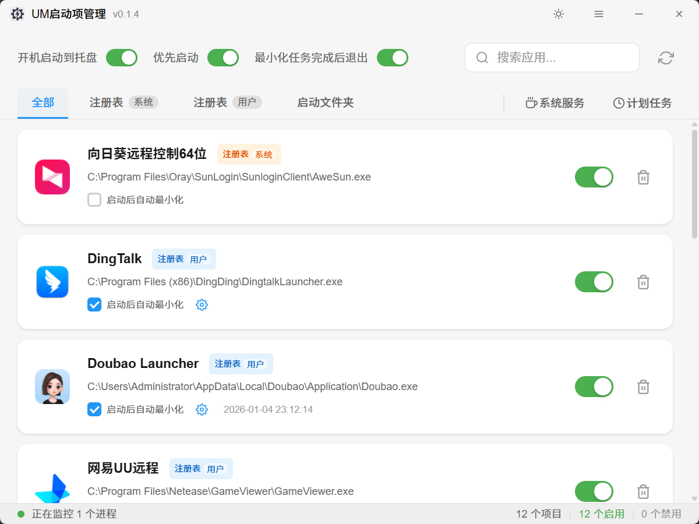
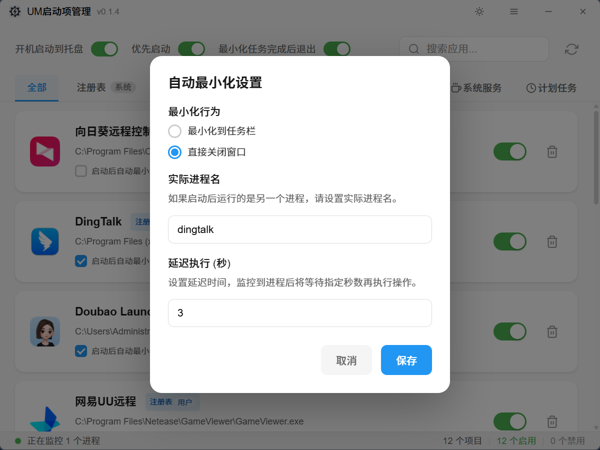
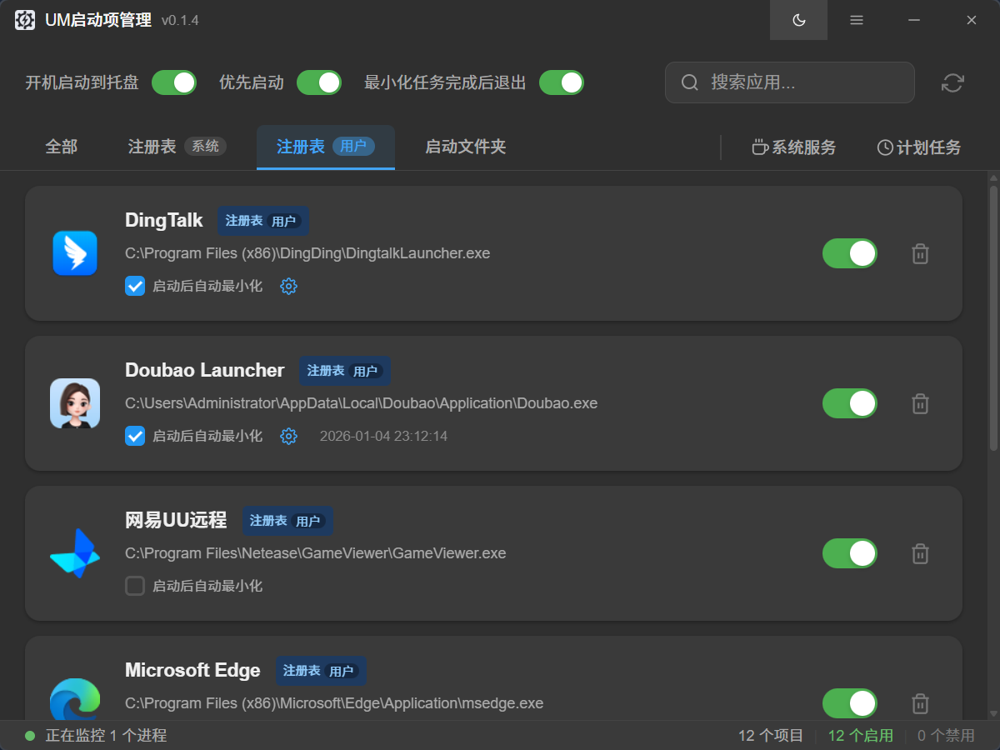

# UM 启动项管理器

[](https://tauri.app/)
[](https://vuejs.org/)
[](https://www.typescriptlang.org/)
[](https://www.rust-lang.org/)
[](https://um-startup-manager.fqurl.cn/)

一个基于 Tauri 2.0 和 Vue 3 构建的现代化 Windows 启动项管理工具。
支持任意软件启动后最小化，维持开机后桌面整洁。

## 🎯 核心功能

- 查看和管理系统启动项
- 启用/禁用启动项
- 删除不需要的启动项
- 自动最小化启动程序

## 📸 截图展示

| 主界面                                         | 启动项管理                                             | 设置界面                                         |
| ---------------------------------------------- | ------------------------------------------------------ | ------------------------------------------------ |
|  |  |  |

## 🛠️ 技术栈

| 技术           | 版本 | 用途               |
| -------------- | ---- | ------------------ |
| **Tauri**      | 2.0  | 跨平台桌面应用框架 |
| **Vue**        | 3.5  | 前端框架           |
| **TypeScript** | 5.6  | 类型安全           |
| **Rust**       | 2024 | 后端逻辑           |
| **Vite**       | 6.0  | 构建工具           |

## 🚀 快速开始

### 环境要求

- Node.js >= 18.0.0
- Rust >= 1.68
- Windows 10/11 (主要支持平台)

### 安装依赖

```bash
# 克隆项目
git clone <repository-url>
cd um-startup-manager

# 安装前端依赖
npm install

# 安装 Rust 依赖
cd src-tauri
cargo fetch
cd ..
```

### 开发模式

```bash
# 启动开发服务器
npm run tauri dev
```

### 构建生产版本

```bash
# 构建应用
npm run tauri build

# 构建后的文件位于
src-tauri/target/release/
```

## 📁 项目结构

```
um-startup-manager/
├── 📁 .vscode/                      # VSCode 配置
│   └── 📄 extensions.json          # 推荐扩展配置
├── 📁 landing-page/                 # 项目 landing page
│   ├── 📁 .vscode/                 # VSCode 配置
│   │   └── 📄 extensions.json      # 推荐扩展配置
│   ├── 📁 public/                  # 静态资源
│   │   ├── 📄 Screenshot1.png      # 截图1
│   │   ├── 📄 Screenshot2.png      # 截图2
│   │   ├── 📄 Screenshot3.png      # 截图3
│   │   ├── 📄 app-icon.png         # 应用图标
│   │   └── 📄 favicon.ico          # 网站图标
│   ├── 📁 src/                     # Vue 源码
│   │   ├── 📄 App.vue             # 主应用组件
│   │   └── 📄 main.js             # 应用入口
│   ├── 📄 .gitignore               # Git 忽略配置
│   ├── 📄 README.md               # 项目文档
│   ├── 📄 index.html              # HTML 模板
│   ├── 📄 jsconfig.json           # JavaScript 配置
│   ├── 📄 package-lock.json       # NPM 依赖锁定
│   ├── 📄 package.json            # NPM 依赖配置
│   └── 📄 vite.config.js          # Vite 配置
├── 📁 src/                          # Vue 前端源码
│   ├── 📁 components/               # Vue 组件
│   │   ├── 📄 TitleBar.vue         # 自定义标题栏
│   │   ├── 📄 StartupList.vue      # 启动项列表
│   │   └── 📄 StartupItem.vue      # 启动项项组件
│   ├── 📁 assets/                  # 静态资源
│   │   └── 📄 app-icon.png         # 应用图标
│   ├── 📁 types/                   # TypeScript 类型定义
│   │   └── 📄 startup.ts           # 启动项类型定义
│   ├── 📄 App.vue                  # 主应用组件
│   ├── 📄 main.ts                  # 应用入口
│   └── 📄 vite-env.d.ts            # Vite 环境类型
├── 📁 src-tauri/                    # Tauri 后端源码
│   ├── 📁 capabilities/            # 权限配置
│   │   └── 📄 default.json         # 默认权限配置
│   ├── 📁 icons/                   # 应用图标
│   │   ├── 📄 128x128.png          # 128x128 图标
│   │   ├── 📄 128x128@2x.png       # 256x256 图标
│   │   ├── 📄 32x32.png            # 32x32 图标
│   │   ├── 📄 64x64.png            # 64x64 图标
│   │   ├── 📄 icon.ico             # 应用图标
│   │   └── 📄 icon.png             # 应用图标
│   ├── 📁 src/                     # Rust 源码
│   │   ├── 📄 main.rs              # Rust 入口文件
│   │   ├── 📄 lib.rs               # Tauri 命令定义
│   │   └── 📁 startup/             # 启动项管理模块
│   │       ├── 📄 mod.rs           # 模块入口
│   │       ├── 📄 scanner.rs       # 启动项扫描
│   │       ├── 📄 manager.rs       # 启动项管理
│   │       ├── 📄 monitor.rs       # 进程监控
│   │       ├── 📄 settings.rs      # 配置管理
│   │       └── 📄 icon.rs          # 图标处理
│   ├── 📄 .gitignore               # Git 忽略配置
│   ├── 📄 build.rs                 # 构建脚本
│   ├── 📄 Cargo.toml               # Rust 依赖配置
│   ├── 📄 Cargo.lock               # Rust 依赖锁定
│   └── 📄 tauri.conf.json          # Tauri 配置文件
├── 📄 .gitignore                    # Git 忽略配置
├── 📄 CHANGELOG.md                 # 更新日志
├── 📄 README.md                    # 项目文档
├── 📄 index.html                    # HTML 模板
├── 📄 package-lock.json            # NPM 依赖锁定
├── 📄 package.json                  # NPM 依赖配置
├── 📄 tsconfig.json                # TypeScript 配置
├── 📄 tsconfig.node.json           # Node TypeScript 配置
└── 📄 vite.config.ts               # Vite 配置
```

## ⚙️ 配置说明

### 窗口配置

在 `src-tauri/tauri.conf.json` 中配置应用窗口属性：

```json
{
  "app": {
    "windows": [
      {
        "label": "main",
        "title": "UM启动项管理",
        "width": 800,
        "height": 600,
        "decorations": false, // 无边框设计
        "center": true, // 屏幕居中
        "resizable": false, // 禁止调整大小
        "maximizable": false // 禁止最大化
      }
    ]
  }
}
```

### 主题配置

支持深色模式自动切换：

```typescript
// 自动检测系统主题
const isDarkMode = ref(
  window.matchMedia("(prefers-color-scheme: dark)").matches
);

// 监听主题变化
window
  .matchMedia("(prefers-color-scheme: dark)")
  .addEventListener("change", (e) => {
    isDarkMode.value = e.matches;
    document.documentElement.classList.toggle("dark", isDarkMode.value);
  });
```

## 🔧 开发指南

### 添加新功能

1. **前端组件** (`src/components/`)

   - 创建新的 Vue 组件
   - 添加 TypeScript 类型定义
   - 实现响应式数据绑定

2. **后端命令** (`src-tauri/src/`)
   - 在 `lib.rs` 中定义新命令
   - 实现对应的 Rust 函数
   - 更新前端 API 调用

### 代码规范

- **Vue 组件**: 使用 Composition API
- **TypeScript**: 启用严格模式
- **Rust**: 遵循 Rust 最佳实践
- **CSS**: 使用 Tailwind CSS 样式

## 🤝 贡献

欢迎提交 Issue 和 Pull Request！

### 贡献流程

1. Fork 项目
2. 创建特性分支 (`git checkout -b feature/AmazingFeature`)
3. 提交更改 (`git commit -m 'Add some AmazingFeature'`)
4. 推送到分支 (`git push origin feature/AmazingFeature`)
5. 开启 Pull Request

## 📄 许可证

本项目基于 MIT 许可证开源 - 查看 [LICENSE](LICENSE) 文件了解详情。

## 🙏 致谢

- [Tauri Team](https://tauri.app/) - 优秀的桌面应用框架
- [Vue Team](https://vuejs.org/) - 优雅的前端框架
- [Rust Community](https://www.rust-lang.org/) - 系统级编程语言

## 🤝 支持开发

如果您觉得这个项目有用，请给个 ⭐️ Star！
如有问题或建议，请提交 [Issue](../../issues)。

如果您觉得这个项目有帮助，也欢迎通过以下方式支持：

| 微信支付                                                              | 支付宝                                                              |
| --------------------------------------------------------------------- | ------------------------------------------------------------------- |
|  |  |

---
